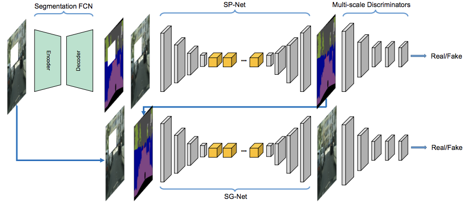

# PyTorch - SegInpaint



This repo is an adapted version of the BMVC 2018 paper: [SPG-Net](http://bmvc2018.org/contents/papers/0317.pdf) by Song et al.

Usage
---

**Prepare the data**

Download the [Cityscapes](https://www.cityscapes-dataset.com/) datasets and the masks from [PartialConv](https://nv-adlr.github.io/publication/partialconv-inpainting). Create a directory `data` and put the downloaded data under `data`.

**Training**

If you want to use the synchronized batchnorm, you can set it up following the steps (credits: [SPADE](https://github.com/NVlabs/SPADE)):
```
cd models/networks/
git clone https://github.com/vacancy/Synchronized-BatchNorm-PyTorch
cp -rf Synchronized-BatchNorm-PyTorch/sync_batchnorm .
cd ../../
```

Train with the following command:
```
python main.py --gpu_ids 0 --batch_size 2
```
and check the results at `logs`.

 
Acknowledgments
---
This code borrows heavily from [SPADE](https://github.com/NVlabs/SPADE) and [pix2pixHD](https://github.com/NVIDIA/pix2pixHD). I also adapt the code from [EdgeConnect](https://github.com/knazeri/edge-connect) for processing the masks for training. Thanks for their amazing works!
